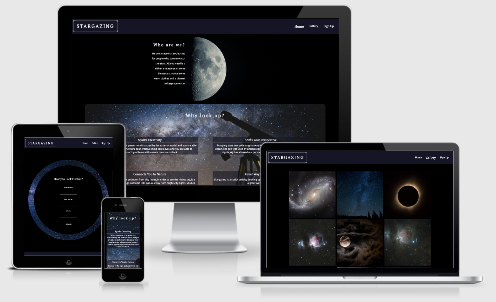
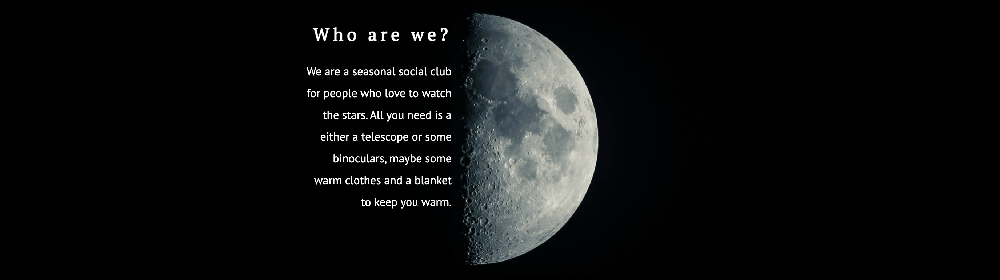
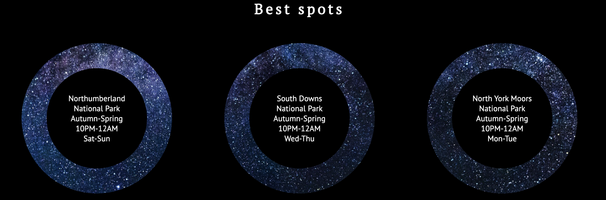
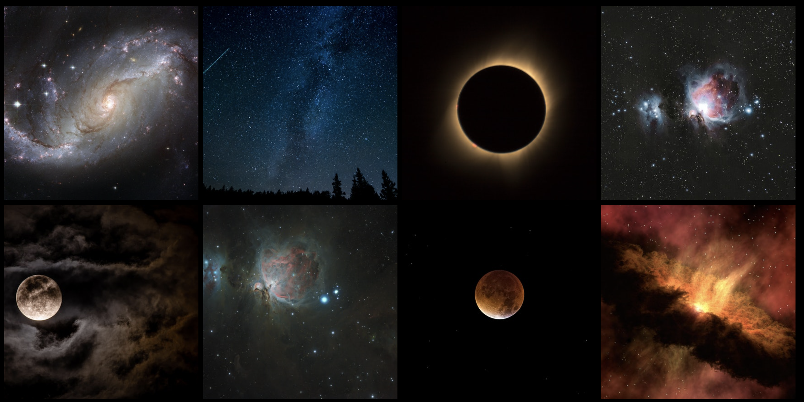
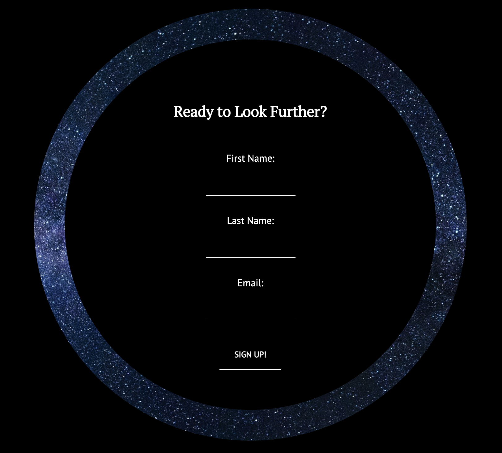

# STARGAZING

Stargazing is a site that aims to inspire people to get out into nature and gaze at the stars whilst sharing the beautiful views with others. The club is appropriate for all age groups, all you need is a keen interest in watching the stars and other celestial bodies. Stargazing would be useful to those who have wanted to watch the stars but did not know when the best times or best places to look up are.
\
\

# Features
## Existing Features

- Navigation Bar
    - The navigation bar is fully responsive and provides links to all three pages of this site; the home page, the gallery page, and the sign up page. The site logo is also featured within the navigation bar. The navigation bar is identical on all three pages to allow easy navigation of the site.
    - The navigation bar is designed to fit with the theme of stargazing. With this in mind, each page navigation link will scale up in size when hovered over and when the page is active to relate to looking at something through a telescope to magnify it.
    - The logo is also designed to fit this theme. The logo has a simple camera frame border around it to resemble looking at something with a camera lens. 
    - This section allows for easy navition of the site without the use of the back button, whilst maintaining the stargazing theme.
\
\

- Landing page/ About section
    - This section has an background image and an text overlay to give a description of who the site is for and the requirements for stargazing.
    - This section has an image of a half moon with a white text overlay on the other side of the moon for a interesting design to draw in the audience's attention.
\
\
 

- Reasons Section
    - This section is intended to highlight the benefits of getting out and looking at the stars, and how it could benefit mental health and be used as a social activity that gets the user out into nature.
    - This section aims to get the user to see the benefits of signing up with Stargazing and making stargazing a fun hobby, as well as a way to take care of their mental health.
    - This section also features a background image of a telescope with the purpose of giving inspiration to the user and demonstrating what might be used to stargaze.
\
\

- Best Spots Section
    - This section's purpose is to inform the user of the best places, time of year, and time of day to stargaze. 
    - The design for this section fits the theme of stargazing. The circular frames that hold the meet up information give the appearance of moving stars as the users scrolls through down the site. This is to resemble looking up at the night sky through a telescope.
    - This is done to give inspiration and excitement to the user, to motivate the user to signup to the stargazing club.
\
\

- The Footer
    - This section holds links to the Stargazing social media that open up on a new page without the user having to leave the Stargazing site. 
    - This section enables the user to stay connected via social media.
\
\

- The Gallery 
    - This page will further inspire the user by showing images of what can be seen when stargazing at night.
    - From this page the user will be able to observe what might be seen when stargazing, and the kind of astronomical events that might occur.
    - To relate back to the theme of this site, the images also scale in size when hovered over. This also allows the user to view the images more clearly.
\
\

- The Sign up page
    - This page allows the user to sign up with Stargazing to realise their new found hobby to look up at the stars.
    - The user is required to input their full name and email to sign up to Stargazing.
    - The sign up form is contained within another circle that resembles looking at the sky through a telescope. the starry background also moves as the user scrolls down the page, continuing the theme of this site.
\
\

## Features Left to Implement

- Another feature that may be implemented to this site would be an Astronomical Events page. This page would have a calendar for upcoming astronomical events, giving a description of the event, the date that the event occurs, and the best time and place to observe it. This page will allow the user to plan for upcoming sitings and stargazing outings.

# Testing

## Manual Testing

For manual testing I checked the Stargazing site accross various different browsers, such as: Google Chrome, FireFox, and Safari. I also checked that some features of this site were supported with other browsers using the sight [caniuse.com](https://caniuse.com/?search=css).

I also tested the site over varying screen widths (320px - 1500px) using devtools, and manually tested the site myself with various different devices, e.g., MacBook and Iphones using Safari, and Samsung using Google Chrome. 

## Bugs
1. Within the Best Spots section, a background image was used to encircle the meet up information. Due to image sizing issues, the background image appeared blurred. Using the CSS property **Background-size** and setting the value to **100%**, the image appeared clear and undistorted. 
2. The gallery page used images with different aspect ratios, because of this, it was difficult making all the images the same width and height without distorting the aspect ratio of the photos. Some images looked compressed or stretched. I fixed this by making each image of the gallery a background image of an individual cell of the CSS grid container and setting the background to **cover**.
3. Because I used background image for the images of the gallery, the **alt** tag was unable to be added. Those using a screen reader would not know what each image was, due to this. To fix this problem, I set the **role** property of each cell in the container div to **img** and then added an **aria-label** to give each div cell a description, as seen below.
\
\

## Validator Testing
HTML - [W3C HTML Validator](https://validator.w3.org/nu/#textarea)

CSS - [W3C CSS Validator](https://jigsaw.w3.org/css-validator/validator)